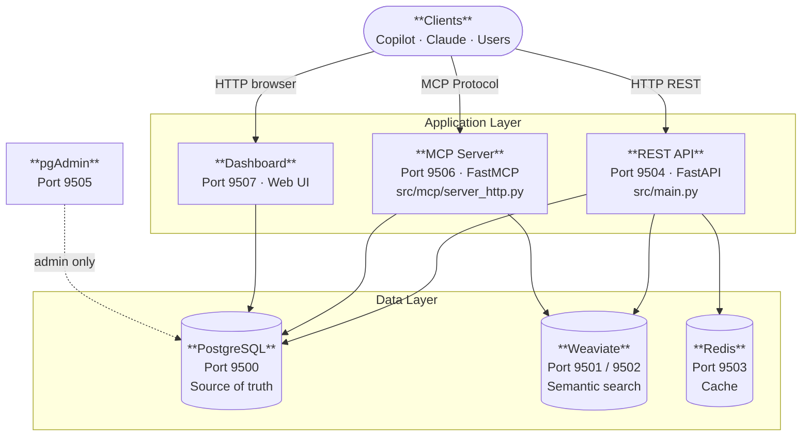
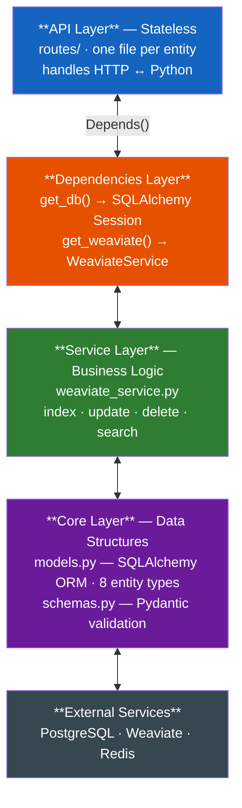
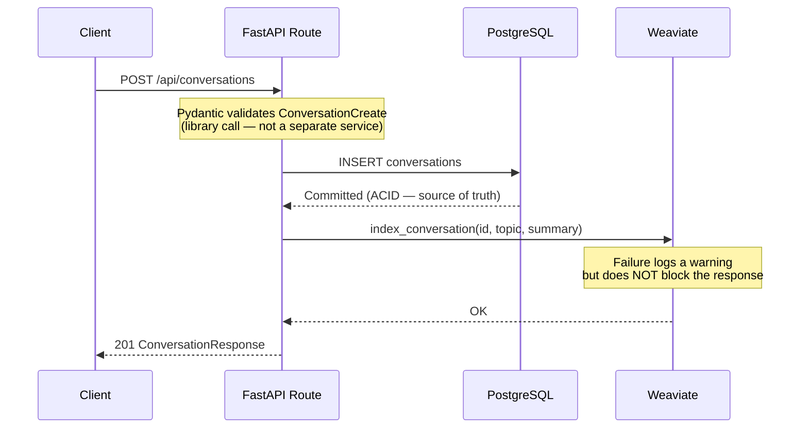
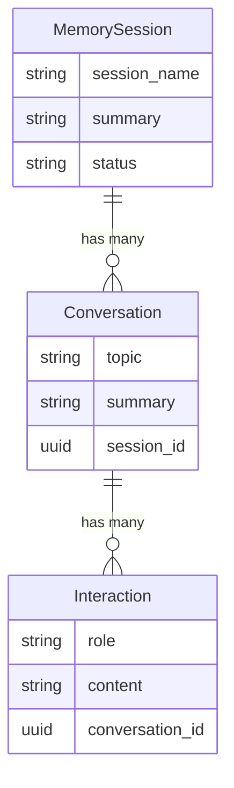
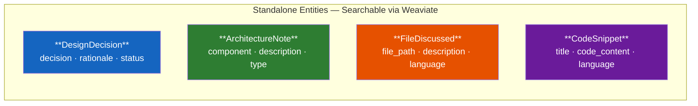
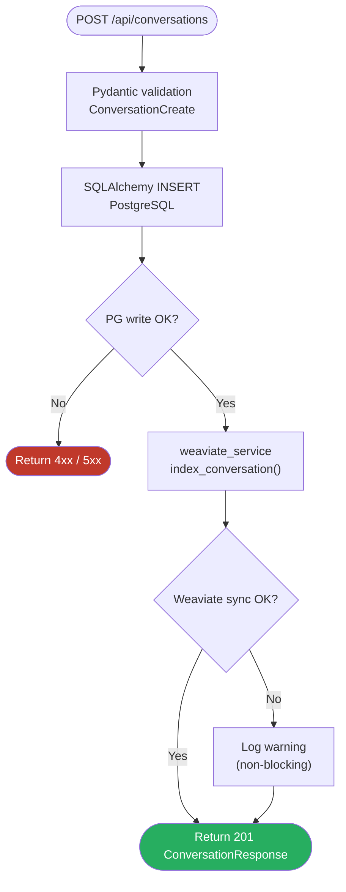
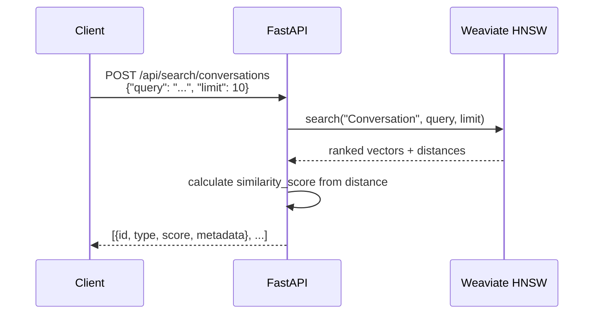
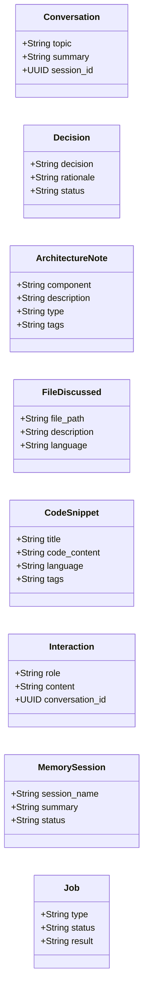

# BrainCell Architecture

## System Overview

Three external entry points share a single data layer. The REST API handles programmatic CRUD and semantic search; the MCP Server exposes tool calls for Copilot and Claude; the Dashboard provides browser-based memory inspection. pgAdmin is an ops-only admin interface.



---

## Services and Ports

BrainCell runs as multiple independent services:

| Service | Port | Purpose |
|---------|------|---------|
| REST API | 9504 | Programmatic access — CRUD and semantic search |
| Dashboard | 9507 | Browser-based memory explorer |
| MCP Server | 9506 | GitHub Copilot / Claude integration |
| PostgreSQL | 9500 | Structured data (source of truth) |
| Weaviate HTTP | 9501 | Vector search |
| Weaviate gRPC | 9502 | Vector search (gRPC) |
| Redis | 9503 | Caching |
| pgAdmin | 9505 | Database admin UI |

The REST API and Dashboard are separate containers that share PostgreSQL, Weaviate, and Redis.

---

## Directory Structure

```
src/
├── main.py                  # FastAPI application entry point
│
├── api/                     # REST API layer
│   ├── dependencies.py      # Shared dependency injection
│   └── routes/
│       ├── __init__.py      # Route registration (create_routes())
│       ├── health.py        # /health
│       ├── conversations.py # Conversation CRUD + vector sync
│       ├── interactions.py  # Message CRUD + vector sync
│       ├── decisions.py     # Decision CRUD + vector sync
│       ├── architecture_notes.py  # Architecture note CRUD + vector sync
│       ├── files.py         # File tracking CRUD + vector sync
│       ├── snippets.py      # Code snippet CRUD + vector sync
│       ├── sessions.py      # Session CRUD + vector sync
│       ├── jobs.py          # Job tracking
│       ├── admin.py         # /admin/sync, /admin/health
│       └── search.py        # Semantic search (all entity types)
│
├── core/
│   ├── config.py            # Settings class
│   ├── database.py          # DB connection
│   ├── models.py            # SQLAlchemy ORM (8 entity types)
│   └── schemas.py           # Pydantic validation schemas
│
├── mcp/
│   ├── server_http.py       # Production — FastMCP, Streamable HTTP
│   ├── server_lean.py       # Lightweight fallback
│   ├── server_stdio.py      # Local / Claude Desktop
│   └── server.py            # Legacy (do not use)
│
├── services/
│   ├── weaviate_service.py  # Vector DB operations
│   └── sync_service.py      # PostgreSQL → Weaviate startup sync
│
└── web/
    ├── app.py               # Dashboard FastAPI app (port 8001)
    └── router.py            # Jinja2 dashboard routes
```

---

## Module Layers

A strict top-down dependency hierarchy. Each layer only calls the one directly below it — routes never touch the database directly, and the service layer never handles HTTP concerns. Copy this diagram to show the dependency direction in code reviews.



---

## Dual-Write Pattern

Every write operation uses this pattern. PostgreSQL is always written first (ACID); Weaviate is synced second and a failure there never fails the request — it only logs a warning.



Rules:
- PostgreSQL write failure → return error to client
- Weaviate sync failure → log warning, still return success
- Data is searchable immediately after the PostgreSQL write (Weaviate indexing may lag slightly)

---

## Entity Types

8 entity types stored in PostgreSQL, mirrored in Weaviate:

| Entity | PostgreSQL Table | Weaviate Collection |
|--------|-----------------|---------------------|
| Conversation | conversations | Conversation |
| Interaction | interactions | Interaction |
| DesignDecision | design_decisions | Decision |
| ArchitectureNote | architecture_notes | ArchitectureNote |
| FileDiscussed | files_discussed | FileDiscussed |
| CodeSnippet | code_snippets | CodeSnippet |
| MemorySession | memory_sessions | MemorySession |
| Job | — (Weaviate only) | Job |

Entity relationships:

The three session-scoped entities form a strict parent-child hierarchy. The remaining four entities are **standalone** — they have no foreign keys to other entities and are stored and searched independently.

**Relational hierarchy** (MemorySession → Conversation → Interaction):



**Standalone entities** (no parent-child relations — directly searchable via vector index):



---

## Request Flow Examples

### Create (POST)

Shows the two-phase write: first PostgreSQL (blocking — failure returns an error), then Weaviate (non-blocking — failure only logs a warning). Both paths converge on a successful 201 response.



### Search (POST /api/search/*)

Text is vectorised by Weaviate's `text2vec-transformers`, then matched against stored embeddings using HNSW approximate nearest-neighbour search. The route converts the raw vector distance into a `similarity_score` (0–1) before returning results.



---

## Performance Characteristics

| Operation | Typical Latency | Notes |
|-----------|----------------|-------|
| GET /api/{id} | ~5ms | Direct SQL lookup |
| POST /api | ~50ms | SQL insert + Weaviate sync |
| PUT /api/{id} | ~60ms | SQL update + re-index |
| DELETE /api/{id} | ~40ms | SQL delete + vector removal |
| POST /api/search | ~200ms | Weaviate HNSW vector search |

Weaviate uses HNSW indexing (~O(log n) search performance) with text2vec-transformers for embeddings.

---

## Weaviate Schema

On startup, the system creates these Weaviate collections if they don't exist. Each field listed here is indexed for vector search. Use this diagram to understand the shape of data returned by `GET /api/search/*` endpoints.



All collections use HNSW indexing with the `text2vec-transformers` vectorizer.

---

## API Endpoint Groups

| Group | Prefix | Purpose |
|-------|--------|---------|
| Health | `/health` | Service health check |
| Conversations | `/api/conversations` | Conversation management |
| Interactions | `/api/interactions` | Message and interaction tracking |
| Decisions | `/api/decisions` | Design decision documentation |
| Architecture Notes | `/api/architecture-notes` | Architecture note storage |
| Files | `/api/files` | File discussion tracking |
| Snippets | `/api/snippets` | Code snippet storage |
| Sessions | `/api/sessions` | Memory session management |
| Search — Conversations | `/api/search/conversations` | Semantic search: conversations |
| Search — Decisions | `/api/search/decisions` | Semantic search: design decisions |
| Search — Snippets | `/api/search/snippets` | Semantic search: code snippets |
| Search — Interactions | `/api/search/interactions` | Semantic search: interactions |
| Search — Notes | `/api/search/notes` | Semantic search: architecture notes |
| Search — Files | `/api/search/files` | Semantic search: files |
| Search — General | `/api/search/general` | Semantic search: all entity types |
| Admin | `/admin/sync` | Trigger PostgreSQL → Weaviate full sync |
| Admin | `/admin/health` | Detailed service health with version info |

---

## MCP vs REST API

| Feature                 | MCP Server (9506)         | REST API (9504)               |
|-------------------------|---------------------------|-------------------------------|
| Search method           | SQL ILIKE (PostgreSQL)    | Weaviate vector search        |
| Transport               | Streamable HTTP / stdio   | HTTP REST                     |
| Use case                | Copilot / Claude tools    | Programmatic CRUD access      |
| Entities covered        | decisions, snippets, notes| All 8 entities                |
| Tools / Endpoints       | 6 MCP tools               | 25+ REST endpoints            |
| Authentication          | None (local use)          | None (local use)              |

MCP tools: `search_memory`, `get_relevant_context`, `save_decision`,
`save_code_snippet`, `save_architecture_note`, `list_memories`
