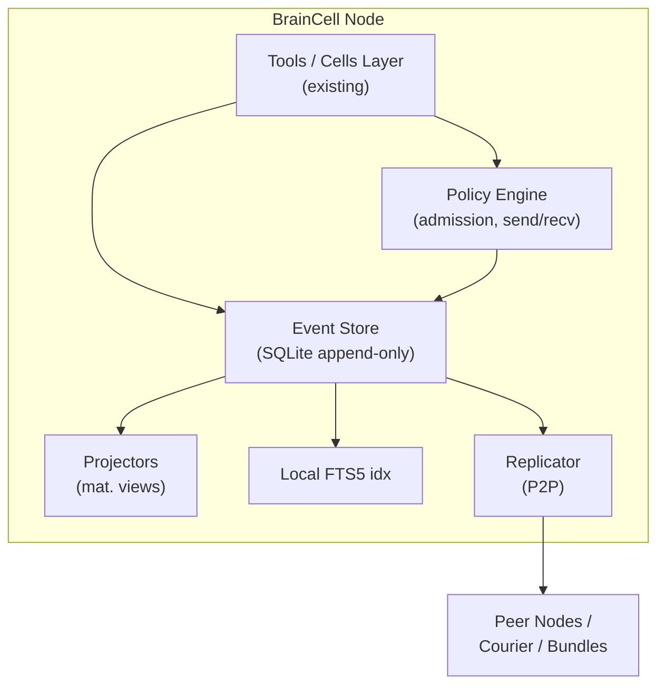
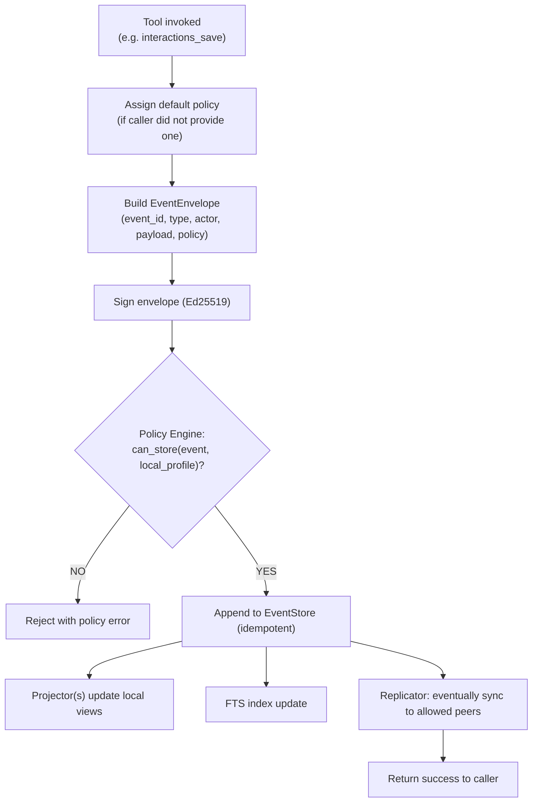
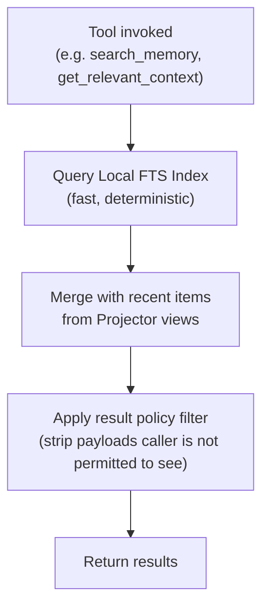
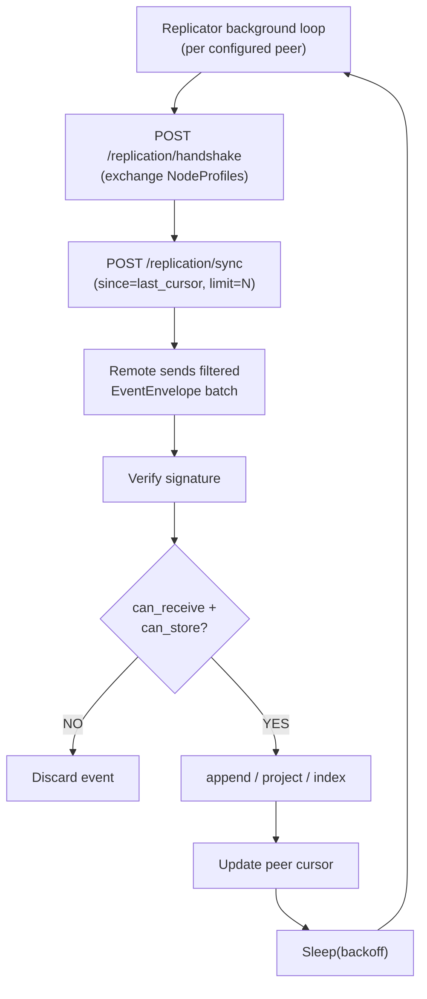
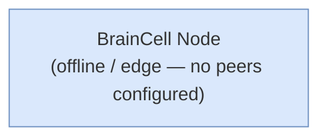
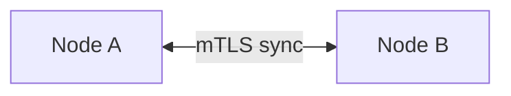
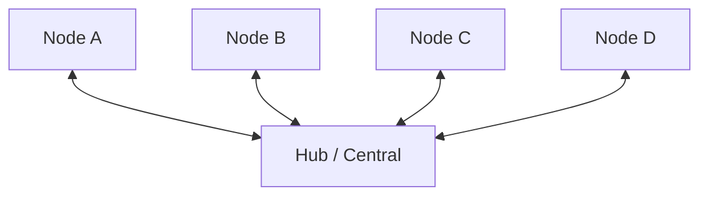
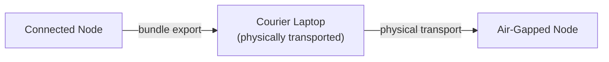

# 01 — Architecture Overview

> Part of the [P2P Offline-First Memory](./README.md) design series.

---

## 1. Goals

| # | Goal |
|---|------|
| G1 | **Local-first writes** — every `*_save` tool call succeeds without network access |
| G2 | **P2P replication** — events are exchanged with filtering based on policy and node profile |
| G3 | **Data residency** — events are never stored/received/sent where not permitted |
| G4 | **Air-gap support** — courier node and signed replication bundles |
| G5 | **Preserve external API surface** — `/tools/*` (MCP) and `/api/*` (REST) continue to work |
| G6 | **Auditable provenance** — every event is signed and optionally hash-chained |

## 2. Non-Goals (MVP)

- Global consistent search across all nodes (each node searches only what it stores).
- Real-time collaborative editing / CRDT (updates are modelled as new events).
- Auto-discovery via libp2p (MVP uses a configured peer list; libp2p is a later phase).

---

## 3. Node Components



### Component responsibilities

| Component | Responsibility |
|-----------|----------------|
| **Tools / Cells Layer** | Existing cell code. Intercepts writes to produce events. |
| **Policy Engine** | Evaluates `can_store`, `can_send`, `can_receive` for every event. |
| **Event Store** | Append-only SQLite log. Single source of truth for all events on this node. |
| **Projectors** | Translate event stream into materialised "memory tables" consumed by existing APIs. |
| **Local FTS Index** | SQLite FTS5 virtual tables for keyword/tag search without central Weaviate. |
| **Replicator** | Cursor-based sync over mTLS HTTP/gRPC; manages peer registry and cursors. |

---

## 4. Write-Path Data Flow



---

## 5. Read-Path Data Flow



---

## 6. Replication Data Flow



---

## 7. Deployment Topologies

### 7.1 Single-node (offline/edge)



### 7.2 Two-node direct sync



### 7.3 Hub-and-spoke



Hub is just another peer with wider policy permissions (can store more, can relay).

### 7.4 Air-gapped site



---

## 8. Integration Strategy with Existing Code

The existing Cells Layer writes to PostgreSQL and Weaviate. The integration adds an **event hook** into each relevant cell's write path:

```python
# Existing (simplified)
async def save_interaction(data):
    record = await db.save(InteractionModel(**data))
    return record

# With event hook
async def save_interaction(data):
    record = await db.save(InteractionModel(**data))          # keep for compat
    event = build_event("interactions.created", data, policy=default_policy())
    await event_store.append(event)                           # new
    return record
```

Cells to migrate first (highest value):
1. `src/cells/interactions/cell.py`
2. `src/cells/decisions/cell.py`

Later phases: all remaining cells.

---

*Next: [02 — Data Model](./02-data-model-events-policy-nodeprofile.md)*
