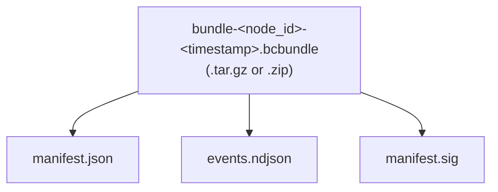

# 06 — Air-Gap: Courier, Bundles & Diode

> Part of the [P2P Offline-First Memory](./README.md) design series.

---

## 1. Overview

BrainCell supports two patterns for moving data across air-gapped or physically isolated boundaries:

| Pattern | Use Case |
|---------|---------|
| **Courier node** | Laptop/device physically carries events between sites |
| **Replication bundle** | Signed, policy-filtered file transferred via any physical medium |

Both patterns share the same **Policy Engine** rules — events that cannot leave a node via normal replication also cannot leave via bundles (unless `may_transit=true` and the payload is encrypted).

---

## 2. Courier Node

### 2.1 How It Works

1. Courier laptop connects to the **source network** and runs standard `POST /replication/sync` (pull mode).
2. The courier's `NodeProfile` has `role=courier` and a restricted `NodeCapabilities` (only non-restricted events by default).
3. Policy Engine on the source node evaluates each event against the courier's profile before sending.
4. Courier is physically transported to the **target (air-gapped) network**.
5. Target node runs `POST /replication/sync` against the courier (now the courier acts as the "source peer").
6. Policy Engine on the target node evaluates each event before storing.

### 2.2 Courier NodeProfile Example

```json
{
  "node_id": "courier-laptop-01",
  "org_id": "itl",
  "jurisdiction": "NL",
  "derived_domains": { "EU": true, "5eyes": false },
  "groups": ["peer-group:airgap-export"],
  "role": "courier",
  "capabilities": {
    "can_store_restricted": false,
    "has_tpm": false,
    "max_classification": "confidential",
    "supported_payload_modes": ["none", "device", "team", "org"]
  }
}
```

### 2.3 Strict Policy for Courier Transit

Events that travel via courier MUST meet all of:
- `policy.may_transit == true`
- `policy.classification` ≤ `courier.capabilities.max_classification`
- If `classification >= confidential`: `payload_cipher` must be set (no plaintext transit)

---

## 3. Replication Bundles

Bundles are self-contained, signed archives containing a batch of events. They are designed to be transferred over any medium (USB, SFTP, S3, email attachment, physical disk).

### 3.1 Bundle Structure



#### `manifest.json`

```json
{
  "bundle_id": "<uuid>",
  "created_at": "2026-04-26T14:00:00Z",
  "source_node_id": "node-eu-prod-01",
  "source_node_profile_hash": "<sha256-base64url>",
  "since_cursor": { "occurred_at": "...", "event_id": "..." },
  "until_cursor": { "occurred_at": "...", "event_id": "..." },
  "event_count": 1432,
  "event_hashes": ["<sha256-base64url>", "..."],
  "policy_filter_applied": {
    "max_classification": "confidential",
    "sharing_scope_includes": ["org:itl", "peer-group:airgap-export"]
  },
  "format_version": "1"
}
```

#### `events.ndjson`

One canonical JSON EventEnvelope per line (newline-delimited JSON).

#### `manifest.sig`

Ed25519 signature over `canonical_json_dumps(manifest.json content)` using the source node's signing key. Base64url-encoded.

### 3.2 Export API

```
POST /replication/export_bundle
```

**Request:**
```json
{
  "since_cursor": { "occurred_at": "...", "event_id": "..." },
  "policy_filter": {
    "max_classification": "confidential",
    "sharing_scopes": ["org:itl", "peer-group:airgap-export"]
  },
  "max_bytes": 104857600,
  "compress": true
}
```

**Response:** Binary bundle stream (or `{"bundle_path": "/tmp/..."}` for server-side storage).

Implementation notes:
- Stream events directly to the bundle to avoid loading all in memory.
- Stop when `max_bytes` is reached; include `has_more` in manifest and a valid `until_cursor`.
- Sign manifest after all events are written.

### 3.3 Import API

```
POST /replication/import_bundle
Content-Type: application/octet-stream
Body: <bundle bytes>
```

**Response:**
```json
{
  "bundle_id": "<uuid>",
  "accepted": 1430,
  "rejected": 2,
  "rejected_details": [
    { "event_id": "...", "reason": "policy: residency violation" }
  ],
  "verification": "ok"
}
```

**Import processing steps:**

```
1. Unpack bundle (verify integrity: file count, sizes)
2. Verify manifest.sig against source node's known public key
   → reject bundle if signature invalid
3. Verify each event's hash against manifest.event_hashes list
   → reject individual events with hash mismatch, continue others
4. For each event in events.ndjson:
   a. Verify event.signature
   b. policy_engine.can_receive(event, source_node_profile)
   c. policy_engine.can_store(event, local_profile)
   d. event_store.append (idempotent)
   e. projector.dispatch + search_index.index
5. Log audit record: bundle_id, source_node_id, accepted, rejected
```

### 3.4 Partial Bundles & Multi-Part Transfer

For large datasets or slow media:
- Generate multiple bundles with overlapping cursor ranges.
- Importer deduplicates by `event_id` (idempotent append).
- Include `part_number` and `total_parts` in manifest for tracking.

---

## 4. Data Diode Policy

A **data diode** enforces one-way data flow at the node role level.

| Role | `can_send` | `can_receive` |
|------|-----------|--------------|
| `normal` | ✓ | ✓ |
| `courier` | ✓ | ✓ (with caps) |
| `diode-out` | ✓ | ✗ (never receives events) |
| `diode-in` | ✗ | ✓ (never sends events) |

### 4.1 Diode-Out Node (Export Only)

Used when a node must only export data outward (e.g., sending telemetry out of a secure enclave):
- Accept normal cell writes.
- Serve `POST /replication/sync` and `POST /replication/export_bundle`.
- Reject all `POST /replication/push` and import bundle requests.

### 4.2 Diode-In Node (Import Only)

Used when a node must only receive data (e.g., an air-gapped node that only accepts physical bundle imports):
- Accept local writes.
- Accept `POST /replication/import_bundle`.
- Reject all sync-pull and export requests (return 403 with `role=diode-in` reason).

### 4.3 Configuration

```yaml
# config/node.yaml
node:
  role: diode-out   # normal | courier | central | diode-out | diode-in
```

---

## 5. Audit Requirements

All bundle operations generate audit log entries:

```json
{
  "ts": "2026-04-26T14:00:00Z",
  "operation": "bundle_export",
  "bundle_id": "<uuid>",
  "source_node_id": "node-eu-prod-01",
  "policy_filter": { "...": "..." },
  "event_count": 1432,
  "operator_id": "agent:braincell-replicator"
}
```

```json
{
  "ts": "2026-04-26T16:00:00Z",
  "operation": "bundle_import",
  "bundle_id": "<uuid>",
  "source_node_id": "node-eu-prod-01",
  "accepted": 1430,
  "rejected": 2,
  "verification": "ok",
  "operator_id": "agent:braincell-replicator"
}
```

Write to `logs/bundle_audit.ndjson`.

---

*Next: [07 — Media-Aware Transfer](./07-media-aware-transfer.md)*
