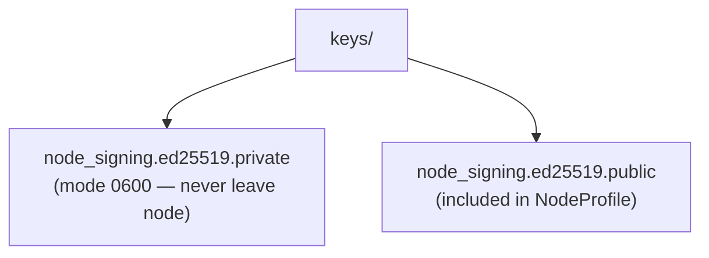
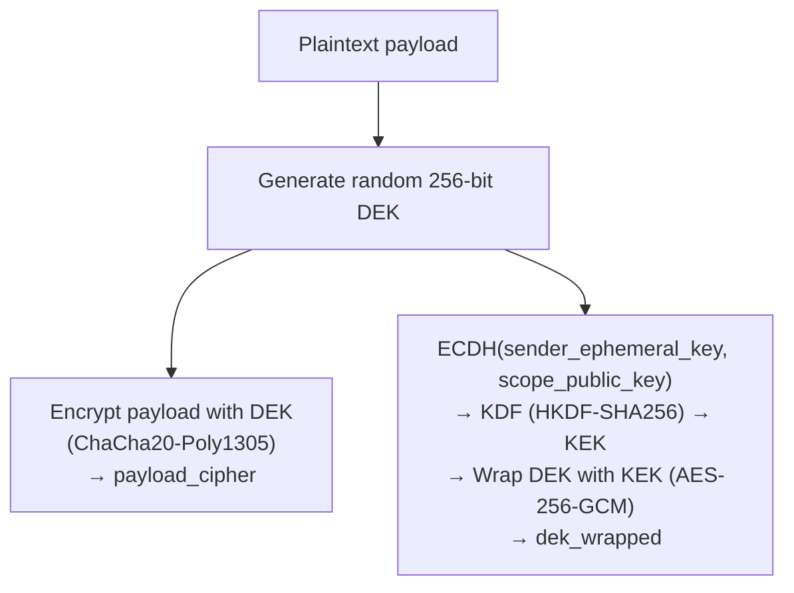

# 08 — Security, Crypto & Identity

> Part of the [P2P Offline-First Memory](./README.md) design series.

---

## 1. Threat Model (Summary)

| Threat | Mitigation |
|--------|-----------|
| Eavesdropping on replication traffic | mTLS between all peers |
| Rogue peer injecting events | Ed25519 event signatures + peer admission |
| Tampered events in transit/storage | Per-event hash + optional tamper-evident chain |
| Data exfiltration to wrong jurisdiction | Policy Engine (residency, 5-eyes, scope rules) |
| Replay of old bundles | Bundle `created_at` + `bundle_id` deduplication |
| Insider reading restricted payloads | Encryption-by-scope (DEK wrapped to scope key) |
| Key compromise | Key versioning + rotation; quarantine on verification failure |

---

## 2. Transport Security (mTLS)

All P2P and replication HTTP connections use **mutual TLS**:

- Each node has a TLS certificate issued by the org CA (or self-signed with explicit fingerprint pinning).
- Peers are admitted only if their certificate is in the **allowlist** (`config/peers.yaml`, field `tls_fingerprint`).
- TLS 1.3 minimum; no TLS 1.0/1.1.
- Cipher suites: `TLS_AES_256_GCM_SHA384`, `TLS_CHACHA20_POLY1305_SHA256`.

```python
# FastAPI/uvicorn TLS setup (config/tls.yaml → startup)
ssl_context = ssl.SSLContext(ssl.PROTOCOL_TLS_SERVER)
ssl_context.load_cert_chain(certfile="certs/node.crt", keyfile="certs/node.key")
ssl_context.load_verify_locations(cafile="certs/org-ca.crt")
ssl_context.verify_mode = ssl.CERT_REQUIRED
ssl_context.minimum_version = ssl.TLSVersion.TLSv1_3
```

---

## 3. Event Signing

### 3.1 Algorithm

- **Ed25519** (fast, small keys, wide support via `cryptography` library).
- Each node has a dedicated **signing key pair** (separate from TLS key).

### 3.2 Key Storage



For production nodes with TPM: use TPM-backed key storage. The signing API remains the same.

### 3.3 Signing Process

```python
from cryptography.hazmat.primitives.asymmetric.ed25519 import Ed25519PrivateKey

def sign_event(event: EventEnvelope, private_key: Ed25519PrivateKey) -> bytes:
    # Build canonical form excluding signature field
    envelope_dict = asdict(event)
    envelope_dict.pop("signature", None)
    canonical = canonical_json_dumps(envelope_dict).encode("utf-8")
    return private_key.sign(canonical)
```

### 3.4 Verification Process

```python
from cryptography.hazmat.primitives.asymmetric.ed25519 import Ed25519PublicKey
from cryptography.exceptions import InvalidSignature

def verify_signature(event: EventEnvelope, public_key: Ed25519PublicKey) -> bool:
    envelope_dict = asdict(event)
    signature = envelope_dict.pop("signature")
    envelope_dict.pop("hash", None)  # also exclude hash if present
    canonical = canonical_json_dumps(envelope_dict).encode("utf-8")
    try:
        public_key.verify(signature, canonical)
        return True
    except InvalidSignature:
        return False
```

Verification failures must:
1. Log with `structlog` at `ERROR` level including `event_id`, `node_id`, `peer_id`.
2. Quarantine the event in `events_quarantine` table (same schema as `events`, plus `quarantine_reason`).
3. Never append to the main EventStore.

### 3.5 Hash Chain (Tamper-Evidence)

Each node maintains a hash chain of its own events:

```python
def compute_event_hash(event: EventEnvelope) -> bytes:
    envelope_dict = asdict(event)
    envelope_dict.pop("hash", None)
    envelope_dict.pop("signature", None)
    canonical = canonical_json_dumps(envelope_dict).encode("utf-8")
    return hashlib.sha256(canonical).digest()
```

`prev_hash` = hash of the previous event from the **same node** (by `occurred_at` order).  
This creates a per-node append-only hash chain, detectable if any historical event is modified.

---

## 4. Payload Encryption by Scope

### 4.1 Motivation

Even if an event passes policy (e.g., `sharing_scope=org:itl`), individual members of the org may not be authorised to read the plaintext payload. Scope encryption ensures only key holders for the scope can decrypt.

### 4.2 Payload Modes

| Mode | Description | Key source |
|------|-------------|-----------|
| `none` | Plaintext; no encryption | — |
| `device` | Encrypted to local node key; never leaves node | node encryption key |
| `team` | Encrypted to team scope key | team X25519 public key |
| `org` | Encrypted to org scope key | org X25519 public key |

### 4.3 Envelope Encryption



```python
payload_cipher_meta = {
    "algorithm": "chacha20-poly1305",
    "nonce": base64url(nonce),
    "dek_wrapped": base64url(wrapped_dek),
    "key_id": scope_key_id,
    "scope": sharing_scope,
    "ephemeral_public_key": base64url(ephemeral_pub),
}
```

### 4.4 Decryption

```python
def decrypt_payload(
    payload_cipher: bytes,
    payload_cipher_meta: dict,
    scope_private_key: X25519PrivateKey,
) -> dict:
    ephemeral_pub = X25519PublicKey.from_public_bytes(
        base64url_decode(payload_cipher_meta["ephemeral_public_key"])
    )
    shared = scope_private_key.exchange(ephemeral_pub)
    kek = HKDF(algorithm=SHA256(), length=32, ...).derive(shared)
    dek = aes_gcm_unwrap(kek, base64url_decode(payload_cipher_meta["dek_wrapped"]))
    nonce = base64url_decode(payload_cipher_meta["nonce"])
    plaintext = chacha20_poly1305_decrypt(dek, nonce, payload_cipher)
    return json.loads(plaintext)
```

---

## 5. Key Management

### 5.1 Key Types

| Key | Algorithm | Stored | Purpose |
|-----|-----------|--------|---------|
| Node signing key | Ed25519 | `keys/node_signing.*` | Sign events |
| Node encryption key | X25519 | `keys/node_encryption.*` | ECDH for `device` scope |
| Team scope key | X25519 | `keys/teams/<team_id>.*` | ECDH for `team` scope |
| Org scope key | X25519 | `keys/orgs/<org_id>.*` | ECDH for `org` scope |
| TLS key | RSA-4096 / ECDSA-P384 | `certs/node.key` | mTLS |

### 5.2 Key Rotation

1. Generate new key pair; assign `key_id` = `<type>-<date>-<random4hex>`.
2. Publish new public key in NodeProfile (include both current and `key_id`).
3. All new events use the new key.
4. Keep old private keys available for decryption for `retention_days` of the oldest event that used them.
5. After retention window: securely delete old private key.

### 5.3 Revocation

If a key is compromised:
1. Remove from NodeProfile immediately.
2. Broadcast `node.key_revoked` event to all peers.
3. Peers quarantine any events signed with the revoked key received after the revocation timestamp.
4. Events signed before revocation are treated as valid (recorded fact, not re-verified).

---

## 6. Node Identity

### 6.1 `node_id` Assignment

- Stable UUID assigned at first startup.
- Stored in `data/node_id` (plain text file, mode 0600).
- Never regenerated (loss = identity loss; backup this file).

### 6.2 Org CA Trust (Optional)

For cross-org replication with delegated trust:
- Org CA signs each NodeProfile → `profile_signature`.
- Peers verify `profile_signature` against known org CA public key.
- Org CA keys are distributed via out-of-band configuration.

---

## 7. Secret Management Best Practices

- Never commit private keys to source control.
- Use environment variables or a secrets manager (Vault, AWS Secrets Manager, Azure Key Vault) to inject keys at runtime.
- In Docker/Kubernetes: mount keys as secrets volumes, not environment variables.
- Rotate TLS certs before expiry (set up automated renewal, e.g., cert-manager).

---

*Next: [09 — Testing, Observability & Ops](./09-testing-observability-ops.md)*
