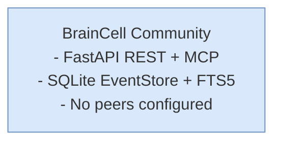
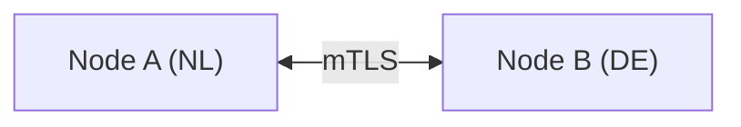
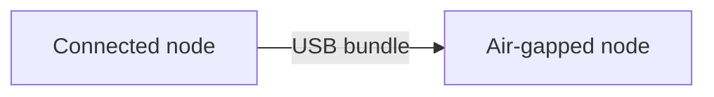

# 10 — Editions & Packaging

> Part of the [P2P Offline-First Memory](./README.md) design series.

---

## 1. Edition Overview

BrainCell ships in three editions that enable progressively more complex deployment scenarios:

| Feature | **Community** | **Professional** | **Enterprise** |
|---------|:---:|:---:|:---:|
| Local-first writes & reads | ✓ | ✓ | ✓ |
| SQLite EventStore | ✓ | ✓ | ✓ |
| Projectors + FTS5 search | ✓ | ✓ | ✓ |
| P2P replication (configured peers) | — | ✓ | ✓ |
| Policy Engine (residency, legal domain) | — | ✓ | ✓ |
| Event signing (Ed25519) | — | ✓ | ✓ |
| Scope encryption (team/org) | — | — | ✓ |
| Air-gap bundles (export/import) | — | — | ✓ |
| Courier node support | — | — | ✓ |
| Data diode roles | — | — | ✓ |
| Media-aware transfer profiles | — | — | ✓ |
| Audit log (`policy_audit.ndjson`) | — | ✓ | ✓ |
| Prometheus metrics | — | ✓ | ✓ |
| `braincell-admin` CLI | — | ✓ | ✓ |
| Keycloak JWT auth | — | ✓ | ✓ |
| Multi-tenant PostgreSQL schemas | — | — | ✓ |
| Org CA / delegated trust | — | — | ✓ |
| SLA + enterprise support | — | — | ✓ |

---

## 2. Deployment Variants

### 2.1 Standalone (single node, no replication)

Minimal footprint for dev, CI, or single-site use.



Docker image: `ghcr.io/itlusions/braincell:latest`  
Compose target: `docker-compose.yml` (default)

### 2.2 Replicated Cluster (2+ nodes)



Same image; peer list configured in `config/peers.yaml`.  
Compose target: `docker-compose.replicated.yml` (add `BRAINCELL_EDITION=professional`)

### 2.3 Hub-and-Spoke

Central hub node with unrestricted policy + multiple spoke nodes with stricter policies.

Typical use:
- Hub: `role=central`, `max_classification=restricted`, stores everything
- Spokes: `role=normal`, `max_classification=confidential`, forward to hub

### 2.4 Air-Gapped Site



Nodes configured with `role=diode-out` (source) and `role=diode-in` (destination) respectively, or both `normal` if bidirectional sync is needed via courier.

### 2.5 Kubernetes (Production)

See [Kubernetes deployment guide](../deployment/KUBERNETES.md).

Key additions for P2P:
- Persistent volume for `data/` (EventStore, blobs).
- Kubernetes Secret for `keys/`.
- NetworkPolicy restricting `/replication/*` to peer node IPs.
- CronJob for bundle export (air-gap pattern).

---

## 3. Configuration Reference

### 3.1 Core (`config/node.yaml`)

```yaml
node:
  node_id: ""              # auto-generated if blank (stored in data/node_id)
  org_id: "itl"
  jurisdiction: "NL"
  role: normal             # normal | courier | central | diode-out | diode-in
  edition: community       # community | professional | enterprise

storage:
  event_db_path: "data/braincell_events.db"
  views_db_path: "data/braincell_views.db"
  blob_dir: "data/blobs"
  backup_dir: "data/backups"

keys:
  signing_private_key_path: "keys/node_signing.ed25519.private"
  signing_public_key_path: "keys/node_signing.ed25519.public"
  encryption_private_key_path: "keys/node_encryption.x25519.private"
  encryption_public_key_path: "keys/node_encryption.x25519.public"
  key_rotation_warning_days: 30

tls:
  certfile: "certs/node.crt"
  keyfile: "certs/node.key"
  cafile: "certs/org-ca.crt"
  min_version: "TLSv1.3"
```

### 3.2 Replication (`config/peers.yaml`)

See [05 — Replication Protocol §2](./05-replication-protocol.md#2-peer-registry).

### 3.3 Policy Regions (`config/policy_regions.yaml`)

See [04 — Policy Engine §4](./04-policy-engine.md#4-jurisdiction--region-mapping-config).

### 3.4 Media Profiles (`config/media_profiles.yaml`)

See [07 — Media-Aware Transfer §2.2](./07-media-aware-transfer.md#22-media-profile-configuration).

### 3.5 Environment Variables

| Variable | Default | Description |
|----------|---------|-------------|
| `BRAINCELL_EDITION` | `community` | Edition flag |
| `BRAINCELL_NODE_YAML` | `config/node.yaml` | Node config path |
| `BRAINCELL_PEERS_YAML` | `config/peers.yaml` | Peer config path |
| `BRAINCELL_EVENT_DB_PATH` | `data/braincell_events.db` | EventStore path |
| `BRAINCELL_SIGNING_KEY_PATH` | `keys/node_signing.ed25519.private` | Signing key |
| `BRAINCELL_LOG_LEVEL` | `info` | Log level |
| `BRAINCELL_AUDIT_LOG_PATH` | `logs/policy_audit.ndjson` | Audit log file |

---

## 4. Docker Image

### 4.1 Image Tags

| Tag | Description |
|-----|-------------|
| `latest` | Community edition |
| `pro-latest` | Professional edition |
| `enterprise-latest` | Enterprise edition |
| `0.2.0` | Specific version |

### 4.2 Minimal Compose for P2P (Professional)

```yaml
# docker-compose.p2p.yml
version: "3.9"

services:
  braincell-node-a:
    image: ghcr.io/itlusions/braincell:pro-latest
    environment:
      BRAINCELL_EDITION: professional
      BRAINCELL_NODE_YAML: /config/node-a.yaml
      BRAINCELL_PEERS_YAML: /config/peers-a.yaml
    volumes:
      - ./config/node-a.yaml:/config/node-a.yaml:ro
      - ./config/peers-a.yaml:/config/peers-a.yaml:ro
      - ./keys/node-a:/keys:ro
      - ./certs/node-a:/certs:ro
      - braincell-data-a:/app/data
    ports:
      - "9504:9504"
    networks:
      - braincell-mesh

  braincell-node-b:
    image: ghcr.io/itlusions/braincell:pro-latest
    environment:
      BRAINCELL_EDITION: professional
      BRAINCELL_NODE_YAML: /config/node-b.yaml
      BRAINCELL_PEERS_YAML: /config/peers-b.yaml
    volumes:
      - ./config/node-b.yaml:/config/node-b.yaml:ro
      - ./config/peers-b.yaml:/config/peers-b.yaml:ro
      - ./keys/node-b:/keys:ro
      - ./certs/node-b:/certs:ro
      - braincell-data-b:/app/data
    ports:
      - "9514:9504"
    networks:
      - braincell-mesh

volumes:
  braincell-data-a:
  braincell-data-b:

networks:
  braincell-mesh:
```

---

## 5. Upgrade Path

| From version | To version | Migration notes |
|-------------|-----------|-----------------|
| 0.1.x | 0.2.0 | Run `braincell-admin migrate-eventstore` to initialise EventStore from existing PG/Weaviate data |
| 0.2.x | 0.3.0 | Replication protocol v2 (backward compat); update `protocol_version` in peers config |
| 0.3.x | 1.0.0 | Stable API; no schema changes expected |

All EventStore schema changes are handled by Alembic migrations (`alembic upgrade head`).

---

*Next: [11 — Rollout Roadmap](./11-rollout-roadmap.md)*
