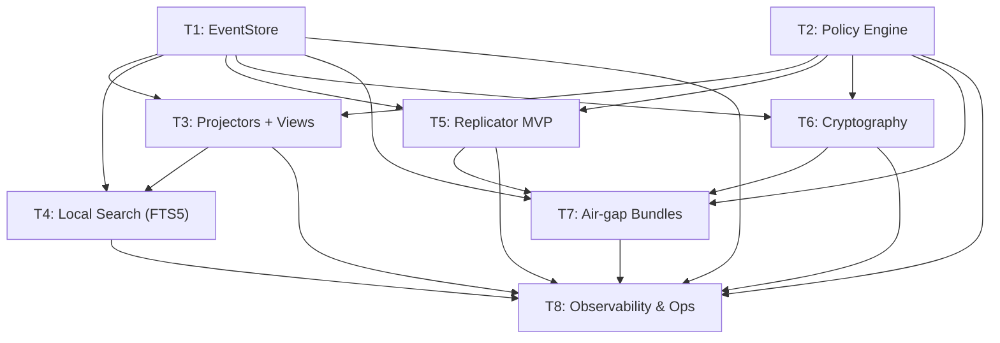

# 11 — Rollout Roadmap

> Part of the [P2P Offline-First Memory](./README.md) design series.

---

## Overview

Implementation follows a **vertical slice** approach: each ticket (T1–T8) delivers a working, testable piece. Later tickets build on earlier ones. Start with T1 and T2 in parallel; then T3, T4; then T5, T6; then T7, T8.

---

## T1 — EventStore (SQLite)

**Sprint:** 1  
**Effort:** M (3–5 days)  
**Owner:** Backend engineer

### Deliverables

- [ ] `src/event_store/schema.py` — SQLite schema definitions (events, peer_cursors, events_quarantine)
- [ ] `src/event_store/store.py` — `SQLiteEventStore` implementing `EventStore` protocol
- [ ] `src/event_store/models.py` — `EventEnvelope`, `Cursor`, `Policy` dataclasses
- [ ] `src/event_store/canonical.py` — `canonical_json_dumps()`, `compute_event_hash()`
- [ ] `alembic/versions/<n>_create_eventstore.py` — migration
- [ ] `tests/test_event_store.py` — unit tests (append, get_since, has, idempotency, cursor pagination)
- [ ] `config/node.yaml` (stub)

### Acceptance Criteria

- All unit tests pass.
- Duplicate `event_id` inserts are silently ignored (no exception).
- `get_since(None)` returns all events from beginning.
- SQLite WAL mode enabled by default.

---

## T2 — Policy Engine

**Sprint:** 1  
**Effort:** M (3–5 days)  
**Owner:** Backend engineer

### Deliverables

- [ ] `src/policy/engine.py` — `PolicyEngine` implementation
- [ ] `src/policy/models.py` — `Policy`, `NodeProfile`, `NodeCapabilities`, `PolicyDecision`, `AdmissionResult`
- [ ] `src/policy/regions.py` — region/jurisdiction expansion functions
- [ ] `config/policy_regions.yaml` — EU, 5-eyes, NATO mappings
- [ ] `tests/test_policy_engine.py` — full rule unit tests (see [04 — Policy Engine §7](./04-policy-engine.md#7-testing-the-policy-engine))

### Acceptance Criteria

- All 10 test cases from §7 pass.
- Policy denials produce structured audit log entries.
- `PolicyEngine` is stateless (safe to use as a singleton).

---

## T3 — Projectors & Materialised Views

**Sprint:** 2  
**Effort:** M (3–5 days)  
**Owner:** Backend engineer  
**Depends on:** T1

### Deliverables

- [ ] `src/projectors/base.py` — `Projector` protocol, `ProjectorRegistry`
- [ ] `src/projectors/decisions.py` — `DecisionsProjector`
- [ ] `src/projectors/interactions.py` — `InteractionsProjector`
- [ ] `src/projectors/conversations.py` — `ConversationsProjector`  
  *(remaining cells: add in subsequent sprints)*
- [ ] View schema migrations (Alembic or inline SQLite CREATE TABLE IF NOT EXISTS)
- [ ] `braincell-admin rebuild-projections` CLI command
- [ ] `tests/test_projectors.py` — per-projector unit tests
- [ ] Integration: hook projector dispatch into cells `interactions_save`, `decisions_save`

### Acceptance Criteria

- After saving 10 interactions via MCP tool, querying the interactions endpoint returns 10 items backed by the projector view.
- `rebuild-projections` truncates views and replays EventStore; end state is identical.
- Idempotent: replaying the same event twice produces identical view state.

---

## T4 — Local Search (FTS5)

**Sprint:** 2  
**Effort:** S (2–3 days)  
**Owner:** Backend engineer  
**Depends on:** T1, T3

### Deliverables

- [ ] `src/search/index.py` — `FTS5SearchIndex` with `index(event)` and `search(query, ...)` methods
- [ ] FTS5 virtual tables + triggers (in Alembic migration or inline)
- [ ] `src/search/relevance.py` — `rank_and_merge()` for `get_relevant_context`
- [ ] Integration: wire `search_memory` MCP tool to `FTS5SearchIndex.search`
- [ ] Integration: wire `get_relevant_context` MCP tool to `relevance.rank_and_merge`
- [ ] `tests/test_search.py` — keyword match, empty results, multi-cell search

### Acceptance Criteria

- `search_memory("decision about deployment")` returns relevant decisions within 50 ms on 10k events.
- `get_relevant_context("...")` returns blended FTS + recent items.
- No Weaviate calls required for search in offline mode.

---

## T5 — Replicator MVP

**Sprint:** 3  
**Effort:** L (1–2 weeks)  
**Owner:** Senior backend engineer  
**Depends on:** T1, T2

### Deliverables

- [ ] `src/replication/handshake.py` — NodeProfile exchange, admission check
- [ ] `src/replication/sync.py` — sender-side filtering, cursor logic
- [ ] `src/replication/receiver.py` — signature verify, policy check, append/project/index
- [ ] `src/replication/loop.py` — background async sync loop, backoff
- [ ] `src/replication/router.py` — FastAPI router for `/replication/*` endpoints
- [ ] `config/peers.yaml` (stub + documentation)
- [ ] mTLS client setup (aiohttp or httpx with ssl context)
- [ ] `tests/test_replication.py` — integration test: 2-node sync, policy filter, idempotency
- [ ] Prometheus metrics (braincell_sync_sessions_total, braincell_replication_lag_events)

### Acceptance Criteria

- Two-node integration test passes (Scenario 2 from [09 — Testing](./09-testing-observability-ops.md)).
- Policy-filtered sync test passes (Scenario 3: EU-only events not delivered to US node).
- Sync resumes from cursor after simulated restart.

---

## T6 — Cryptography

**Sprint:** 3  
**Effort:** M (3–5 days)  
**Owner:** Security-focused backend engineer  
**Depends on:** T1, T2

### Deliverables

- [ ] `src/crypto/signing.py` — `sign_event()`, `verify_signature()`, quarantine on failure
- [ ] `src/crypto/encryption.py` — `encrypt_payload()`, `decrypt_payload()` (envelope encryption)
- [ ] `src/crypto/keys.py` — key loading, rotation tracking, `compute_derived_domains()`
- [ ] Key generation script: `braincell-admin keys generate`
- [ ] Integration: auto-sign events in `EventStore.append`
- [ ] Integration: verify signatures in `Replicator.receiver`
- [ ] `tests/test_crypto.py` — sign/verify, tamper detection, encryption round-trip

### Acceptance Criteria

- Tampered event detection test passes (Scenario 6).
- Encrypted payload round-trip: encrypt with team key, decrypt with team key → identical plaintext.
- Events with invalid signatures land in `events_quarantine`, not `events`.

---

## T7 — Air-Gap Bundles

**Sprint:** 4  
**Effort:** M (3–5 days)  
**Owner:** Backend engineer  
**Depends on:** T1, T2, T5, T6

### Deliverables

- [ ] `src/bundles/exporter.py` — streaming bundle export, manifest signing
- [ ] `src/bundles/importer.py` — bundle verification, per-event processing
- [ ] `src/bundles/router.py` — FastAPI endpoints `POST /replication/export_bundle`, `POST /replication/import_bundle`
- [ ] Chunked transfer support (configurable `chunk_size_bytes`)
- [ ] Diode role enforcement in exporter/importer
- [ ] `logs/bundle_audit.ndjson` writer
- [ ] `tests/test_bundles.py` — export/import round-trip, bad manifest sig, bad event sig, idempotency

### Acceptance Criteria

- Bundle round-trip test passes (Scenario 5).
- `diode-in` node rejects export requests with HTTP 403.
- `diode-out` node rejects import requests with HTTP 403.
- Replaying same bundle produces `accepted=0` (all idempotent).

---

## T8 — Observability & Ops

**Sprint:** 4  
**Effort:** S (2–3 days)  
**Owner:** DevOps / backend engineer  
**Depends on:** T1–T7

### Deliverables

- [ ] Extended `GET /health` response (see [09 — Testing §2.3](./09-testing-observability-ops.md#23-health-endpoint))
- [ ] `GET /metrics` Prometheus endpoint
- [ ] `braincell-admin` CLI: `peers list`, `peers add`, `peers remove`, `quarantine list`, `quarantine purge`, `rebuild-projections`
- [ ] Audit log writers: `logs/policy_audit.ndjson`, `logs/bundle_audit.ndjson`
- [ ] Backup script (`scripts/backup_eventstore.sh`)
- [ ] Runbook: key rotation (in `docs/deployment/`)
- [ ] Chaos test suite (Scenario 7 + kill-mid-sync)

### Acceptance Criteria

- `GET /health` returns lag and sync status for all configured peers.
- `GET /metrics` parseable by Prometheus.
- `braincell-admin peers list` shows all peers with last-sync-at.
- Audit log entries generated for all policy denials and bundle operations.

---

## Sprint Summary

| Sprint | Tickets | Focus |
|--------|---------|-------|
| 1 | T1, T2 | Foundation: EventStore + Policy |
| 2 | T3, T4 | Projections + Local Search |
| 3 | T5, T6 | Replication + Crypto |
| 4 | T7, T8 | Air-gap + Observability |

Target: **production-ready P2P replication** by end of Sprint 3.  
Target: **air-gap & enterprise hardening** complete by end of Sprint 4.

---

*Next: [12 — FAQ & Glossary](./12-faq-glossary.md)*
